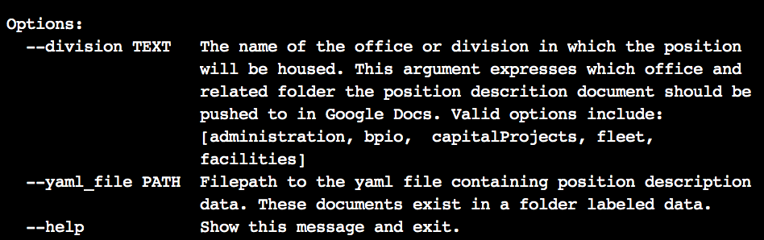
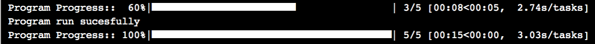
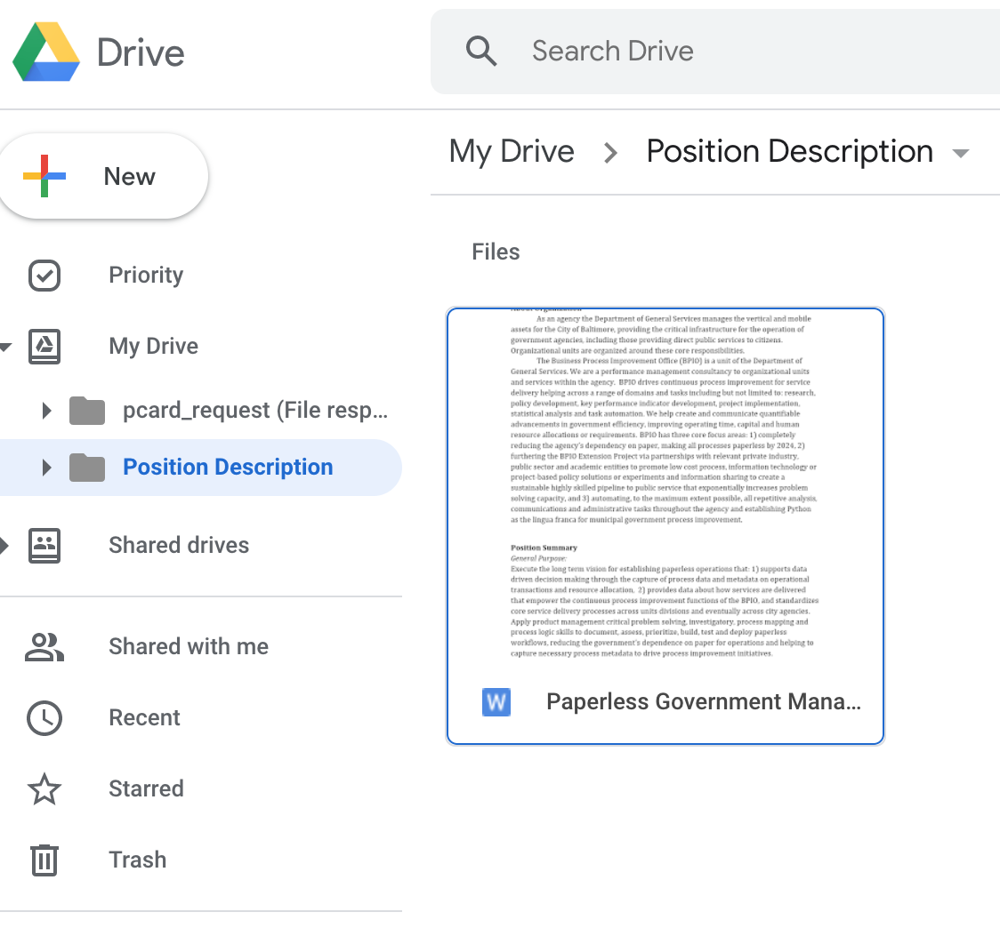
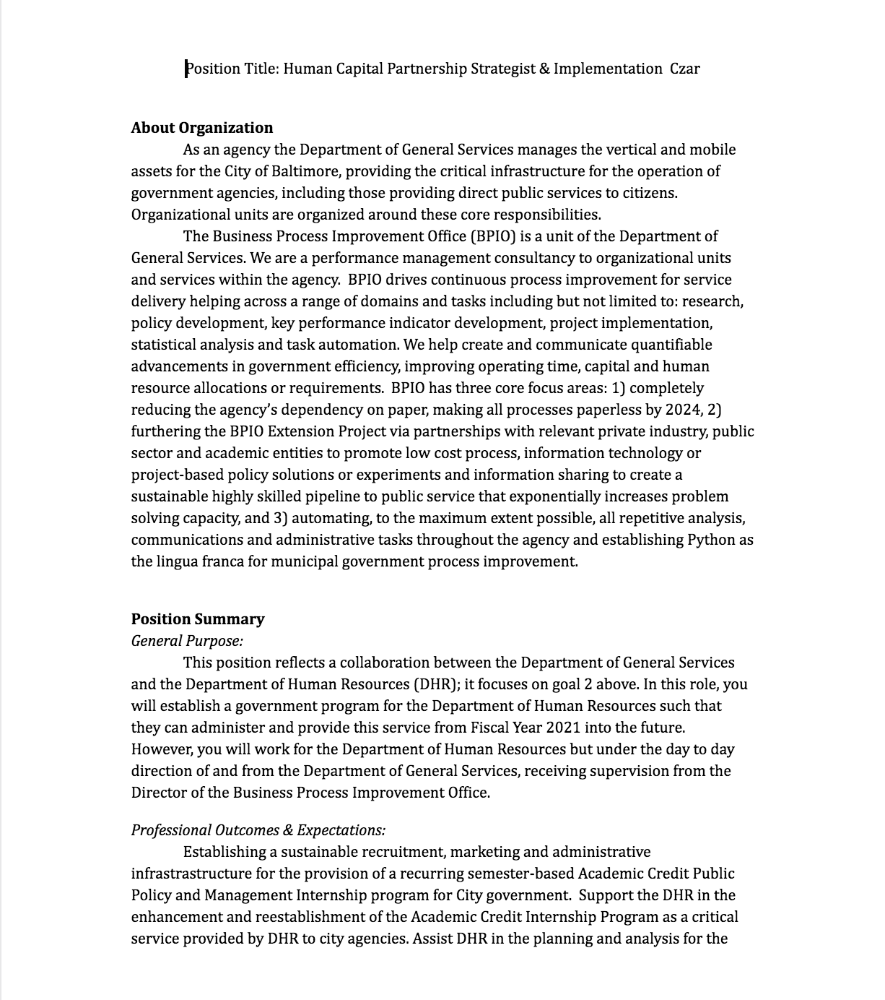
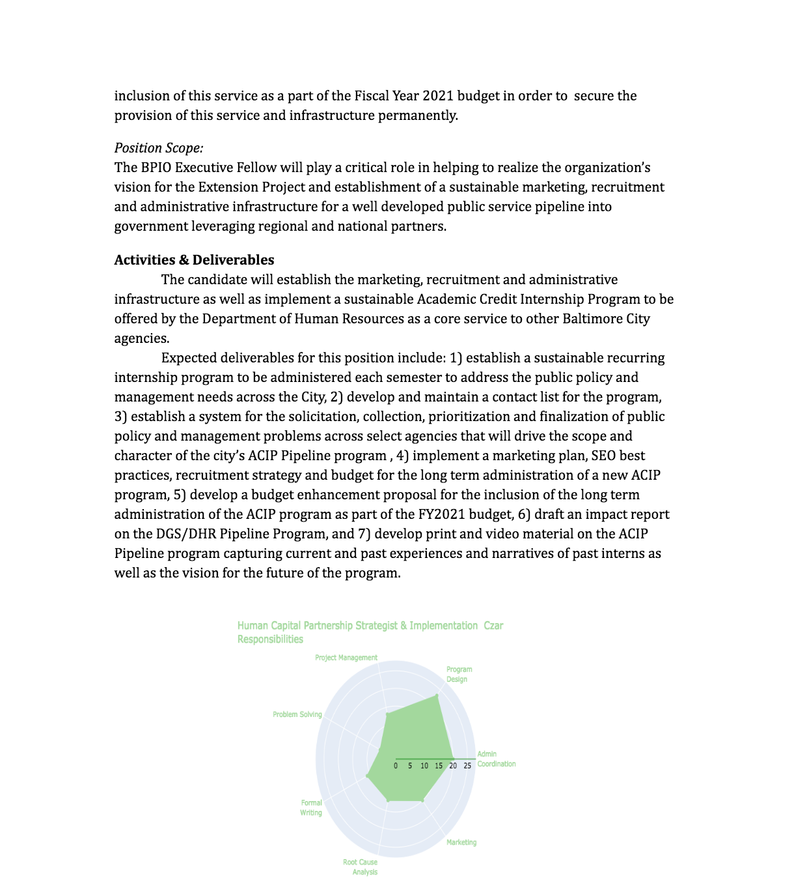

# <font color=green>Position Descriptions</font>
### Position Descriptions is a Python command line application for automating the creation, standardization and file handling for job postings for the Baltimore City [Department of General Services](https://generalservices.baltimorecity.gov/business-process-improvement-office). It is intended to save time with the administrative work associated with creating contractual, civil service, non civil service, youth works, temporary, fellowship or other classes of job postings including the drafting, sharing, and socializing and advertising the position(s). 
 

## What Does It Do?
### In a nutshell, it reads a file with job data, generates a visualization of that job's core task areas and incorporates the visualization into the job posting before sending it to Google Docs for easy storage and sharing. It requires positions to be created in and stored in a yaml file with sections for each core component of a job posting.

## <font color=darkgrey>-- What exactly is Position Descriptions doing?</font>


#### It executes a sequence of tasks for generating and handling standard formatted position descriptions for the agency. The tasks include:
        
    1. Reading and parsing a yaml file with positon data
    2. Converting file data into an easy to use and access object 
    3. Creating an interactive radar chart illustrating job responsibilities
    4. Publishing the chart to a Plotly chart studio account, creating a unique access url for the plot
    5. Creating a directory named 'data/charts', timestamping and saving the chart as a png file to that directory
    6. Creating and saving a standard formated word document for the position description, and inserting the chart image into the document
    7. Logging into Google, identifying a Google Drive folder named 'Position Descriptions' and pushing the word document to that Google Drive folder.


## **Using the Program**
### The program is accessed through the command line by running the application with arguments: "division" and "yaml_file".  The program also includes a help argument that returns the below information in the terminal when running: 
```
$ python position.py --help
```


## The below command is example usage for a job posting for a Paperless Government Manager position in the Business Process Improvement Office (bpio):
```
$ python position.py --division=bpio --yaml_file=data/paperless_manager.yaml
```

## **Primary Output**
### A core program output is a job posting with the following elements: Job Title, Organization Background, Job Summary, Activities & Deliverables, and a radar chart visualizing task area allocation.  Below are images of the Google Drive folder registering a new document and the position description itself.

### Upon run, the application generates a progress bar in the terminal to communicate progress towards the completion of the tasks in the program. 


### The Google Drive account folder now contains the position description. 


### The documents generated have the following format:




## <font color=darkgrey>Secondary Output</font>
### A secondary output of the program is the generation of an interactive radar chart for the position pushed to a Plotly account, accessible through the account  or accesible publicly by anyone with the unique chart url: [example](https://chart-studio.plot.ly/~brl1906/1663) 

## **Requirements & Dependencies**
### The application takes advantage of the [Google Drive](https://www.google.com/drive/) and  [Plotly Chart Studio](https://plot.ly/online-chart-maker/) and has the following core requirements installed via pip. 

### In order to run the program, additional files need to be added to the <font color=green>positions/scripts</font> folder. These files are for :1) handling Google login  , 2) allowing the command line program access to Google Drive and, 3) executing the above two tasks programattically with stored credentials, removing the need for a browser to pop up and a user to interact directly with the program or click buttons or interact with Google. **Ain't nobody got time for clicking buttons**.

### One additional folder needs to be added to the <font color=green>positions/scripts/data</font> folder for handling where the program generated files are sent inside of the Google Drive account.   Info on these 4 files is below:

|Directory  | Filename  | Contents
---| ---| ---|
positions/scripts | *client_secrets.json* | **bunch of secret stuff**
positions/scripts | *credentials.json* | **bunch of secret stuff**
positions/scripts | *settings.yaml* | **some of secret stuff** & ```oauth_scope: PROGRAMACCESSSCOPES```
positions/scripts/data | *google_folders.yaml* | ```folderName: GOOGLEFOLDERNAME``` ```folderID: GOOGLEFOLDERID```


